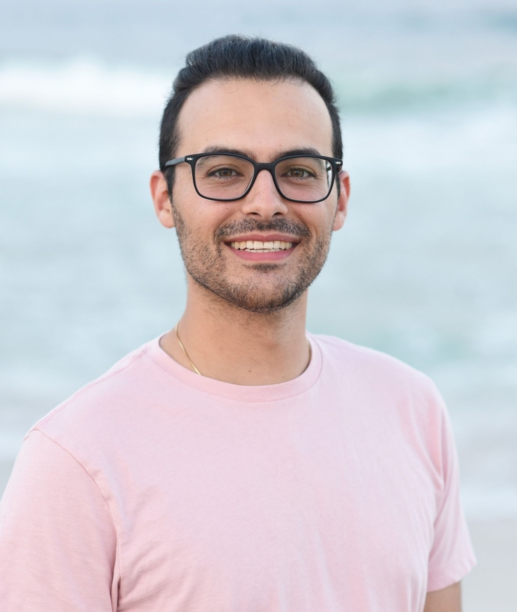

# Meet the Esposito Research Lab!

## Professor Vincent Esposito [CV](https://app.box.com/s/hxjwz9daoea553q8oyxux5es4bilaz33)

Dr. Esposito obtained his Bachelor's degree in chemistry from the University of South Carolina. 
There, he worked with Dr. Susan Richardson studying disinfection by-products in drinking water. 
During his undergraduate studies, Dr. Esposito spent a summer at the NASA Goddard Space Flight Center where he first 
became interested in astrochemistry.

Following his undergraduate studies, he earned his PhD. in Physical Chemistry from the University of Pennsylvania. 
He was co-advised by Dr. Marsha Lester and Dr. Joseph Francisco. During his graduate studies, Dr. Esposito used 
computational methods to study the rotational, vibrational, and electronic spectroscopy of small, metal-bearing 
molecules of astrochemical interest as well as their photochemical pathways. Additionally, he studied the reaction 
dynamics and photochemistry of Criegee intermediates via experimental and computational methods.

Before coming to Chapman, Dr. Esposito was a NASA Postdoctoral Fellow at the NASA Ames Research Center in Mountain View,
CA where he studied the absorption and emission spectra of polycyclic aromatic hydrocarbons (PAHs). These are big 
carbon sheets, often with hydrogens around the outside, but sometimes with other substituents like deuterium and cyano. 

---
## Dr. Rachel Huchmala

Dr. Huchmala works as a Postdoctoral Research Fellow in the Lab. She obtained her Bachelor's degree in chemistry with 
minors in physics and astronomy from Northern Arizona University. There, she discovered her love for astronomy while 
working at the Lowell Observatory. During her final year at NAU, Dr. Huchmala recieved the NASA Arizona Space Grant and 
used computational chemistry to help identify percholrate salts on Mars. 

Rachel earned her PhD in Physical/Theoretical Chemsitry from the University of Washington where she was advised by Prof. 
Anne McCoy. Her disertation work focused on the use of reduced dimensional models to interpret spectral signatures of 
hydrogen bonding (She thinks this is a sophisticated way of she saying she studied water). This work gave her expertise 
in quantum chemistry, but with the launch of the James Webb Space Telescope, she knew she needed to get back into astronomy. 

Before coming to Chapman, Dr. Huchmala was a Postdoctoral Research Fellow at Boise State University where she ran a citizen 
science program and an observational campaign for undergraduate student researchers. These programs were focused on the 
study of exoplanet transits and the hunt for ["Doomed Worlds"](https://www.boisestate.edu/physics-cidsrsn/2024/03/01/first-friday-finding-the-next-doomed-worlds-by-dr-elisabeth-adams/). 
Rachel can't wait to put her passions for chemistry and astronomy together and see what happens! 

---
## Chapman Undergraduate Students
### Ben Smith
### Juliana Jordan
### Stella Erlandson
